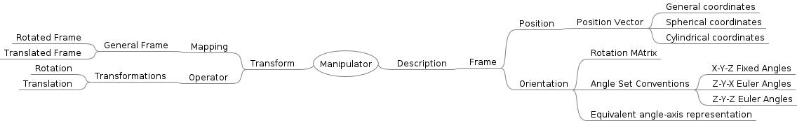
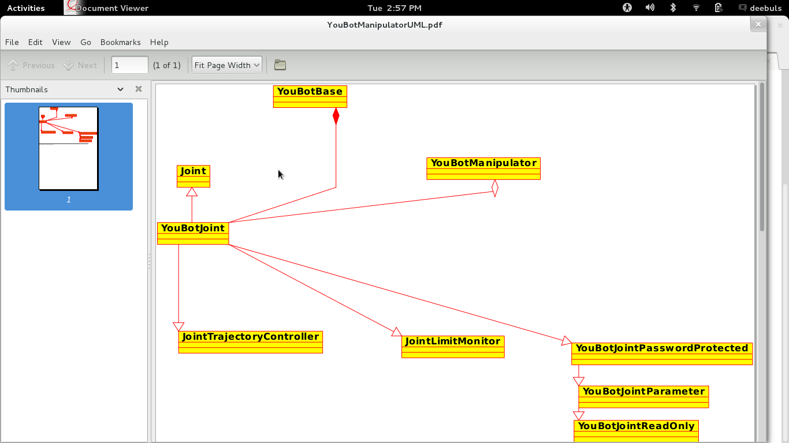

Solution
=======

### Read Frames Chapter from Craig's book and present a mind map.

### Understanding of youbot_driver :
####2.1 Present an overview of the youbot_driver. (Preferably as class diagram,do not detail the member functions).

####2.2. Currently the home position of the robot is calibrated to folded arm.Change the home position to candle position.
The candle position of the arm can be found in the shared
youbot_kdl folder. (hint : setencoders to zero)
You also need to modify the joint limits in the configuration file.
Joint limits for candle position can be found in :
http://www.youbot-store.com/youbot-developers/software/simulation/kuka-youbot-kinematics-dynamics-and-3d-model
####2.3. Write a program which controls first three joints in position mode and the last two in velocity mode.
Solution : [Implemented Here !](code/src/main.cpp)
####2.4. Understand the working of kdl library and provide an interface from kdl to youbot.
Solution : [Implemented Here !](code/src/mainInterface.cpp)
### What is cascaded controller ? Term some advantages of using a cascaded   controller.

A cascade control system is a multiple-loop system where the primary
variable is controlled by adjusting the setpoint of a related secondary
variable controller. The secondary variable then affects the primary variable
through the process.

The advantages of cascade control are as follows:

    1.Better control of the primary variable
    2.Primary variable less affected by disturbances
    3.Faster recovery from disturbances
    4.Increase the natural frequency of the system
    5.Reduce the effective magnitude of a time-lag
    6.Improve dynamic performance

Reference :http://www.sapiensman.com/control/
### Provide a theoretical method of modelling a motor as a spring. (You need to  program it in the next assignment)
